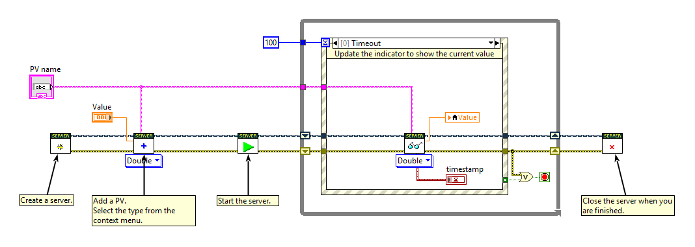
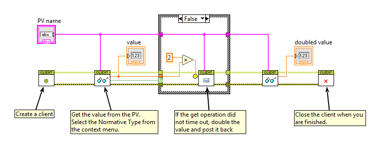

# PVAccess for LabVIEW

An [EPICS PVAccess](https://docs.epics-controls.org/en/latest/pv-access/protocol.html) library for LabVIEW.


## Requirements

The VIPM package is compatible with LabVIEW 2020 or above.

Real-time targets running NI Linux RT 2023 Q1 or above should be compatible.

## Installation

### LabVIEW library (VIPM)

Download the latest `.vip` file from [releases](https://github.com/ISISNeutronMuon/pvaccess-labview/releases) and open it with VIPM.

### NI Linux Real-Time

SSH into the target and run this command, replace `<VERSION>`with the version of the VIP file you have installed.

```bash
wget https://github.com/ISISNeutronMuon/pvaccess-labview/releases/download/v<VERSION>/pva_labview_<VERSION>.ipk
opkg install pva_labview_<VERSION>.ipk
```

## Usage

Find the the PVAccess palette under the "Data Communication" palette in LabVIEW.

Examples of many uses cases can be found using the NI Example Finder, browse via the "Directory Structure" under "EPICS -> PVAccess". Or in the [examples directory](./labview/examples).

### Server

A [minimal example](<./labview/examples/Simple Server.vi>) of starting a PVAccess server with a single NTScalar(Float64) PV, **fetch**ing the current value to a front panel indicator every 100ms, and closing the server after a stop button is clicked.



### Client

A [minimal example](<./labview/examples/Simple Client.vi>) of a PVAccess client **get**ing a PV, **put**ting the double of the value back, then **get**ing it again.



## Development

See [development.md](./docs/development.md).
